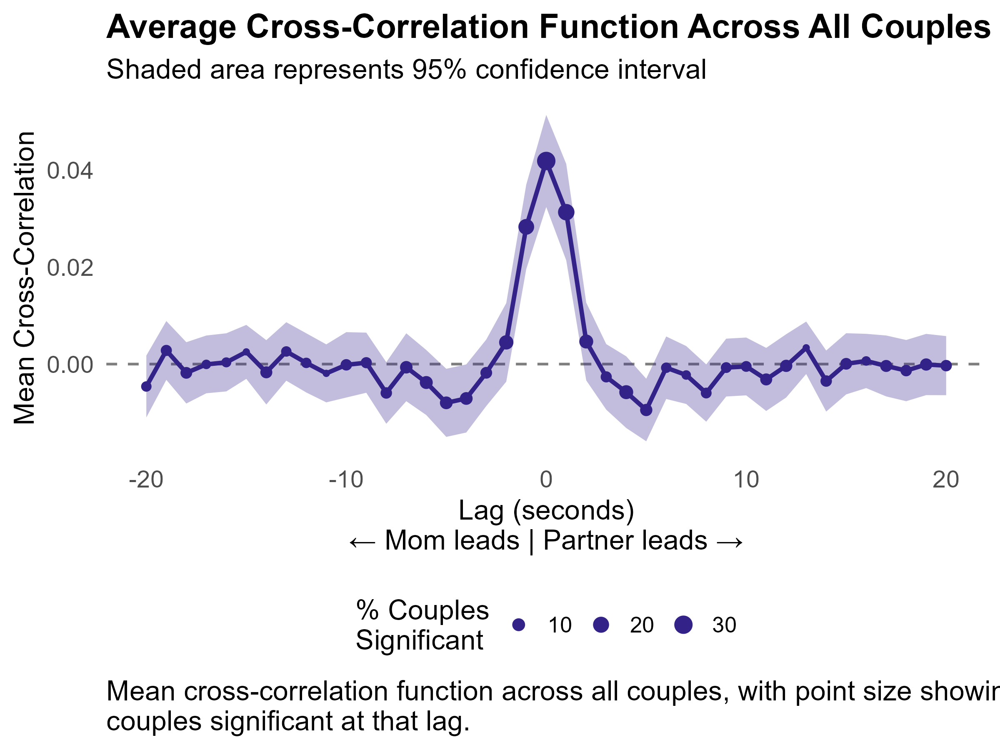
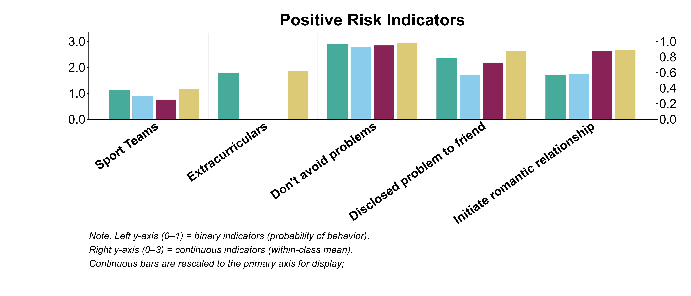

## About this portfolio

This site presents a selection of applied quantitative and behavioral
research projects from my doctoral training in developmental psychology
at Penn State. The projects span complex survey analysis, person-centered
modeling, intensive longitudinal methods, and reproducible behavioral data
pipelines.

Each project pairs methodological explanation with reproducible code so
the reasoning behind the analysis is visible alongside the results.
Code can be expanded or collapsed throughout the site. The source code
and version history are available on [GitHub](https://github.com/rachelcmarcus/rachelcmarcus.github.io).

---

## Projects


:::: {.grid .gap-4}

::: {.g-col-12}
### [Resilience Across Structural Disadvantage](projects/spr-cup/Analysis.qmd)

An end-to-end secondary analysis of Add Health examining why some young
adults function better than expected given adolescent structural
disadvantage. The workflow constructs outcome-specific, empirically
weighted disadvantage composites, derives continuous residual-based
resilience scores, and tests individual, family, school, and community
factors associated with resilience across four young-adult outcomes.

**Methods:** complex survey analysis, regression, composite construction,
residual-based resilience

**Tools:** R, SPSS, Quarto

[View project →](projects/spr-cup/Analysis.qmd)

[{width="50%"}](projects/spr-cup/Analysis.qmd#sec-step4)

*Example result: resilience-factor comparisons across levels of structural disadvantage*
:::

::::

---

:::: {.grid .gap-4}

::: {.g-col-12}
### [Moment-to-Moment Couple Warmth & Synchrony](projects/baseline-warmth-synchrony/Import_BL_WH_Syntax_annotated_v4.qmd)

A three-stage intensive longitudinal workflow for second-by-second
behavioral coding of couple conflict interactions. The project moves
from CARMA file import and inter-rater reliability through trajectory
processing and visualization to pre-whitened cross-correlation analyses
of concurrent and time-lagged dyadic warmth synchrony.

**Methods:** behavioral coding, inter-rater reliability, time-series
processing, ARIMA pre-whitening, cross-correlation

**Tools:** R, CARMA, Quarto

[View project →](projects/baseline-warmth-synchrony/Import_BL_WH_Syntax_annotated_v4.qmd)

[{fig-alt="Average cross-correlation function across couples showing warmth synchrony across positive and negative time lags" width="75%"}](projects/baseline-warmth-synchrony/Baseline-Synchrony_Calculation.qmd)

*Example result: average lagged warmth synchrony across couples*
:::

::::

---

:::: {.grid .gap-4}

::: {.g-col-12}
### [Still Face Behavioral Coding Pipeline](projects/still-face/variable-dictionary.qmd)

A raw-to-analysis-ready behavioral-data pipeline for the 6-month Still
Face Paradigm. The workflow validates subject-level event logs and
episode boundaries, translates continuous onset/offset coding into
duration, frequency, and joint-attention measures, and performs
systematic quality checks before producing a scored analytic dataset.

**Methods:** event-log processing, behavioral coding, data validation,
automated scoring

**Tools:** R, Excel, Quarto

[View project →](projects/still-face/variable-dictionary.qmd)

```{mermaid}
flowchart LR
  A[Raw behavioral<br/>event logs] --> B[Validate IDs &<br/>episode boundaries]
  B --> C[Assign events<br/>to episodes]
  C --> D[Score duration,<br/>counts & overlap]
  D --> E[Analysis-ready<br/>wide dataset]
```

*Example workflow: raw behavioral events to scored analysis variables*
:::

::::

---

:::: {.grid .gap-4}

::: {.g-col-12}
### [Positive & Negative Risk-Taking Profiles](projects/add-health/Profiles.qmd)

Dissertation Study 1 used Add Health data to identify four adolescent
profiles defined jointly by positive and negative risk-taking. The
workflow moves from latent profile characterization to BCH-adjusted
multinomial models estimating predictor odds ratios, followed by
moderation analyses and Benjamini-Hochberg-corrected pairwise
comparisons.

This project is based on Study 1 of my dissertation,
*[Rethinking Adolescent Risk-Taking: Examining Autonomy Support and
Developmental Pathways to Positive and Negative Risk Behaviors Across Low-
and High-Risk Contexts](https://etda.libraries.psu.edu/files/final_submissions/35471)*
([Google Scholar](https://scholar.google.com/scholar?hl=en&as_sdt=0%2C39&q=Rethinking+Adolescent+Risk-Taking%3A+Examining+Autonomy+Support+And+Developmental+Pathways+To+Positive+And+Negative+Risk+Behaviors+Across+Low+And+High-Risk+Contexts&btnG=)).

**Methods:** latent profile analysis, BCH three-step models, multinomial
logistic regression, moderation, multiple-comparison correction

**Tools:** R, Latent GOLD, Quarto

[View project →](projects/add-health/Profiles.qmd)

[{fig-alt="Positive risk-taking indicator profiles across four latent profiles" width="75%"}](projects/add-health/Profiles.qmd)

*Example result: positive risk-taking indicators across the four latent profiles*
:::

::::

## Background

Rachel Marcus, Ph.D., is a developmental psychologist whose work centers
on adolescent development, parenting, prenatal substance exposure, and
developmental cascades, with broader interests in prevention science and
youth positive development. She completed her doctoral training at Penn
State in the Development, Risk, and Resilience Lab under Dr. Rina Eiden and a 
NIDA T-32 Prevention and Methodology Fellowship.

Her methods training spans structural equation and latent variable
modeling, regression and logistic regression, latent class/profile analysis,
complex survey methods, intensive longitudinal analysis, and reproducible 
research workflows in R. She brings more than seven years of experience across
federally funded behavioral research, clinical research, and research data
infrastructure.

## Contact

[LinkedIn](https://www.linkedin.com/in/rachel-c-marcus/) · [rachelmarcus.phd@gmail.com](mailto:rachelmarcus.phd@gmail.com)

